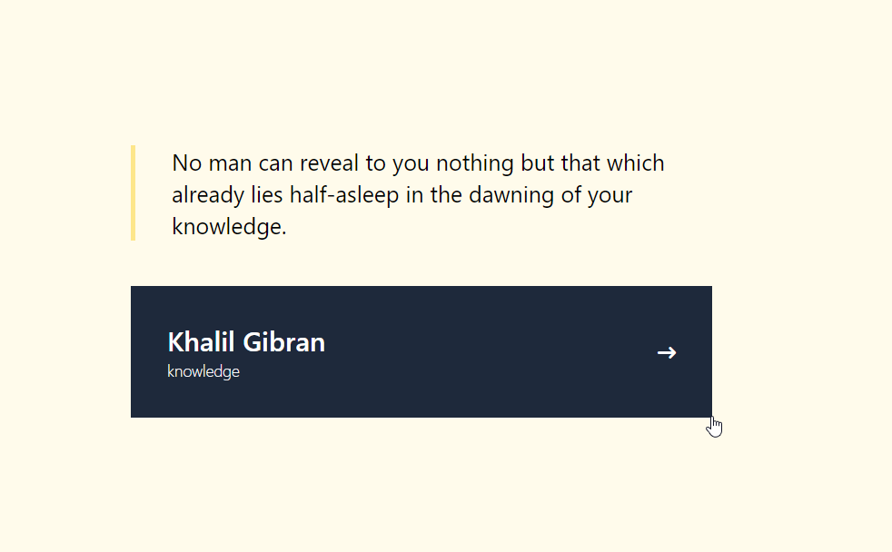

<!-- Please update value in the {}  -->

<h1 align="center">Random quote generator</h1>

<div align="center">
   Solution for a challenge from  <a href="http://devchallenges.io" target="_blank">Devchallenges.io</a>.
</div>

<div align="center">
  <h3>
    <a href="https://weather-forecast-app-87567.web.app/" target="_blank">
      Demo
    </a>
    <span> | </span>
    <a href="https://devchallenges.io/paths/front-end-developer/solutions" target="_blank">
      Solution
    </a>
    <span> | </span>
    <a href="https://devchallenges.io/challenges/8Y3J4ucAMQpSnYTwwWW8" target="_blank">
      Challenge
    </a>
  </h3>
</div>

<!-- TABLE OF CONTENTS -->

## Table of Contents

- [Overview](#overview)
- [Installation](#installation)
- [Built With](#built-with)
- [Features](#features)
- [Acknowledgements](#acknowledgements)


<!-- OVERVIEW -->

## Overview



#### Installation:

1. Clone the repository:

   ```bash
   git clone https://github.com/render217/quote_generator
   ```

2. Navigate into the directory and install dependencies:

   ```bash
   npm install
   ```

3. Start the development server:
   ```bash
   npm run dev
   ```

### Built With

<!-- This section should list any major frameworks that you built your project using. Here are a few examples.-->

- **React** 
- **Tailwind**
- **QuoteGarden** API - Source for real-time weather data.


## Features

<!-- List the features of your application or follow the template. Don't share the figma file here :) -->

This application/site was created as a submission to a [DevChallenges](https://devchallenges.io/challenges) challenge. The [challenge](https://devchallenges.io/challenges/wBunSb7FPrIepJZAg0sY) was to build an application to complete the given user stories.


- User story: I can see a random quote
- User story: I generate a new random quote
- User story: When I select quote author, I can see a list of quotes from them
- User story: I can see quote genre under the author

## Acknowledgements
- [Fontawesome](https://fontawesome.com/)
- [Vercel](https://vercel.com)
- [QuoteGarden Api](https://pprathameshmore.github.io/QuoteGarden/)
